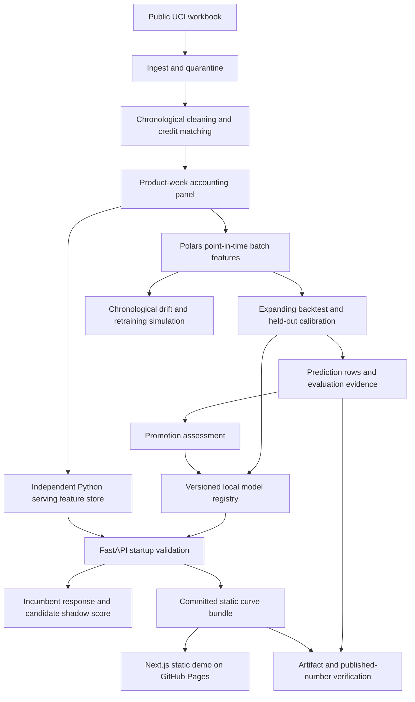

# Architecture

`pricepoint` connects a reproducible historical demand forecast to a constrained pricing service. Its main boundary is evidence: a changed feature definition, failed promotion rule, or unverifiable published metric must be visible before an artifact reaches serving.

## Components and data flow

| Package | Responsibility |
|:--|:--|
| `core` | Strict request schemas, ordered feature contract, environment settings, command-line interface. |
| `data` | Workbook normalization, quarantines, signed accounting, gross-demand panel, batch features, independent serving features. |
| `models` | Baselines, category associations, Tweedie demand model, calibration, temporal evaluation, optimizer, registry, promotion gates. |
| `serve` | Artifact loading, API validation, prediction and optimization routes, shadow comparisons, HTTP metrics. |
| `monitor` | Feature PSI, prediction KS, realized-demand error, persisted trigger decisions, delayed historical refits. |
| `scripts` | Reproducible build, evaluation, packaging, load generation, numerical verification, and publication. |
| `web` | Static-first explorer and analytical views, with an optional API source configured at build time. |

## Artifact boundaries

The raw workbook, transaction-level layers, quarantine rows, local MLflow runs, and intermediate Python evaluation object stay outside version control. Committed artifacts include the aggregated serving panel, training and held-out observations needed to audit results, model manifests and checksums, registry payloads, metric records, verification pairs, and the static demo bundle. The public panel contains product-week information rather than customer-level identifiers.

Parquet is the analytical exchange format. Polars builds the data and feature layers; DuckDB computes the fold summary table. MLflow records local experiments without requiring a tracking server. The serving registry is a separate directory of model versions plus a small incumbent pointer, so prediction does not need a database or MLflow server.

The registry's model files are trusted build outputs. A checksum detects accidental corruption and disagreement with a manifest; it does not make an arbitrary pickle safe. Only artifacts built and reviewed with this repository belong in that directory.

## Time and target semantics

The accounting panel preserves signed quantities and return credits at the time they were observed. Model labels and demand-history features use gross positive units. Forecast revenue consequently describes gross sales value before credits. See [the data contract](docs/data.md) for the accounting reconciliation and the limits of the cancellation heuristic.

Every target week has an exclusive decision cutoff one week earlier. Both feature paths read only weeks before that cutoff. The batch row uses the latest known historical price. Serving can substitute a proposed price in the price-related features, but that substitution does not turn an observational model into a causal pricing experiment.

The Polars batch path and Python serving path implement their arithmetic separately. They share feature names and a public historical calendar helper. `ServingFeatureStore` builds an immutable index at startup and uses bounded caches keyed by product and decision date. A request cannot introduce later observations by extending a point-in-time view. Real-panel deletion checks and deliberate arithmetic corruption are recorded in the [verification artifacts](artifacts/skew.json).

## Evaluation and promotion

The backtest expands its fit window over time. Each fold selects its own eligible products using its fit history, reserves a separate calibration week, and scores an untouched later target week. [Metrics and split semantics](docs/metrics.md) describe the exact ordering and aggregation.

The artifact packager evaluates every promotion rule and records its evidence. An existing baseline is bootstrapped explicitly when a registry has no incumbent. A candidate can replace that pointer only after the complete gate set passes. Training and the historical monitoring simulation do not deploy a service or publish the web site. Packaging and release remain explicit commands with reviewable artifacts.

For the currently published assessment, B2 supplies API and demo responses while C2 is scored in shadow when its fit and calibration are available at the request cutoff. This preserves the measured baseline even when a more elaborate model exists. Current results and gate outcomes belong in [RESULTS](RESULTS.md) and the [promotion record](artifacts/promotion.json), rather than in duplicated architectural numbers.

## Request path

FastAPI loads the incumbent, compatible candidate, panel, and support bounds once during its lifespan. Missing files, checksum mismatches, or incompatible feature contracts fail startup. CPU inference runs through the ASGI thread pool. Request models reject extra fields and invalid numeric values. Unknown products return a missing-product response; unsupported dates and infeasible optimizer constraints return validation errors.

Prediction and curve endpoints expose interval bounds and the model version. The optimizer searches feasible penny prices within the fitted historical support, cost floor, requested markdown range, and inventory cap. It labels boundary optima as extrapolation warnings. B2 demand is price-insensitive, so its curve is flat in units; optimizer choices under this incumbent reflect the supplied arithmetic constraints, not learned causal elasticity.

Shadow scoring returns only the incumbent prediction. It logs the candidate's comparable prediction and disagreement, and retains a bounded in-memory sample for export. The stored shadow distribution describes the selected demo grid; it is not weighted by real traffic.

## Monitoring and release surfaces

Monitoring compares each observed week with the current training reference. A trigger can schedule a future refit after the newly realized labels become available. Its cooldown and idempotency state prevent repeated handling of the same observation. The simulation records completed refits separately from fired triggers, so a trigger at the historical boundary is not presented as a completed action.

The static site needs neither an API key nor a running prediction service. It interpolates committed price surfaces and labels the source. Setting `NEXT_PUBLIC_API_URL` at build time enables the API path; `NEXT_PUBLIC_BASE_PATH` supports project hosting under GitHub Pages.

CI separates source quality, tests, evidence integrity, independent feature agreement, container measurement, and the web build. The isolated warm candidate latency used for promotion is a different measurement from full ASGI request latency and container HTTP latency. Their respective inputs and overheads are reported separately in [RESULTS](RESULTS.md).

## Deliberate limits

This repository demonstrates a complete, inspectable historical loop. It has no live inventory feed, authenticated multi-user operations, durable request queue, production traffic history, regional holiday service, or automatic production deployment. Small local files keep the system inspectable and reproducible. A live operational integration would first need real availability and outcome feeds, access control, durable audit storage, a deployment owner, and a randomized price experiment.
