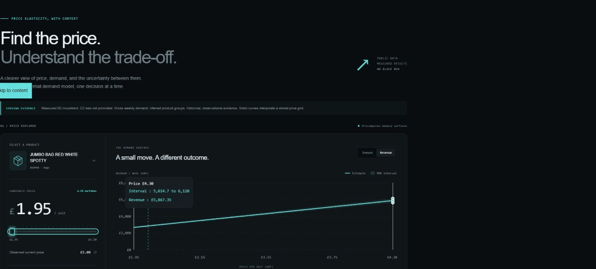

# pricepoint

Price elasticity and constrained markdown decisions on public retail data.

  

**[Open the demo](https://mekala27-45.github.io/pricepoint/)** | [Measured results](RESULTS.md) | [Architecture](ARCHITECTURE.md) | [Runbook](docs/runbook.md)

<!-- skew:start -->
1. 500 sampled feature vectors, two independent computation paths, maximum absolute difference of 1.137e-13.

2. 200 future-deletion checks passed with maximum difference 0.000e+00. Stored pairs and the panel hash make the sample repeatable.
<!-- skew:end -->

The trailing-mean baseline beat the demand candidate, so the service kept the baseline and shadow-scored the candidate. The published demo reflects that decision: demand is flat with respect to price under the selected baseline. The optimizer still respects price support, cost, markdown and inventory constraints.

## What the evaluation found

<!-- summary:start -->
| Model | WAPE (mean +/- SD) | MASE (mean +/- SD) |
| --- | --- | --- |
| B0 | 0.7917 +/- 0.1488 | 1.0787 +/- 0.1105 |
| B1 | 1.2191 +/- 0.2702 | 1.6495 +/- 0.1213 |
| B2 | 0.7043 +/- 0.1061 | 0.9634 +/- 0.0864 |
| B3 | 1.2079 +/- 0.0880 | 4.0954 +/- 0.0919 |
| C1 | 0.8316 +/- 0.1013 | 1.1683 +/- 0.0954 |
| C2 | 0.7150 +/- 0.1307 | 1.0595 +/- 0.1094 |
<!-- summary:end -->

WAPE and MASE are lower-is-better ratios. SD is sample standard deviation across temporal folds. Every fold, the interval comparison, gate outcomes and latency histogram are in [RESULTS.md](RESULTS.md). Price associations are observational and lagged; they do not establish causal revenue uplift.

## Run it

The demo is a static export with committed evidence. It needs no API key or server. Local development uses Python and Node; Docker is only needed for the optional container path.

~~~sh
uv sync --frozen
uv run pricepoint models
uv run pricepoint serve
~~~

Open the API documentation at [localhost](http://127.0.0.1:8000/docs). A sample product can be read from the demo selector or bundle.

~~~sh
uv run pricepoint predict 85099B 2.08 --as-of 2011-12-05
uv run pricepoint optimize 85099B 2.08 1.20 --inventory 80 --max-markdown 0.4
cd web
npm ci
npm run dev
~~~

On Windows PowerShell, the same uv commands work; Make is optional.

## Reproduce the evidence

~~~sh
uv run pricepoint data
uv run pricepoint train
uv run python -c "from pricepoint_data.verification import verify_panel; verify_panel('data/silver/panel.parquet', 'artifacts')"
uv run pricepoint monitor
uv run python -m scripts.package_artifacts
uv run python -m scripts.loadtest --seconds 30 --concurrency 4
uv run python -m scripts.validate_synthetic
uv run python -m scripts.plan_experiment
uv run python -m scripts.publish_results
uv run pricepoint check
~~~

The raw workbook is hash-pinned and never committed. MLflow uses a local file backend, with an explicit opt-in to the file store required by the locked version. Registered models are immutable, checksummed artifacts. Repeating packaging reuses the same evaluated model and records a new gate assessment. The API loads its artifacts once at startup and refuses missing or incompatible models.

## Why the feature tests matter

The Polars training path and independent Python serving store compute the same versioned feature contract. A future-deletion test checks that removing unavailable source rows does not change a feature vector. A separate mutation test intentionally changes a serving rounding rule. These test behaviors that can silently invalidate an otherwise convincing backtest.

Products must have historical sales and price variation before each fold. Credits are matched and netted in an event-time accounting ledger; gross demand is forecast separately. Unmatched credits, non-product charges, invalid prices and outliers are counted rather than silently disappearing. The final incomplete week is excluded from labels.

[Data policy](docs/data.md) explains true zero observations versus unknown availability, all cleaning counts, inferred groups and credit-matching limitations.

## Production loop

- Expanding temporal evaluation compares naive, seasonal, trailing-mean and global log-log baselines with category regressions and a Tweedie demand model.
- Split conformal calibration precedes each test week. Quantile coverage and width are reported alongside it.
- Promotion requires better aggregate error, bounded category regression, measured inference latency, held-out coverage, an exact schema, and independent feature agreement.
- Shadow scoring logs both model versions and their disagreement; only the incumbent is returned.
- Monitoring computes every feature's PSI, prediction KS, realized WAPE, and cooldown-controlled retraining decisions. The historical simulation respects when sales become observable.
- A single-prediction inference benchmark and an end-to-end HTTP benchmark measure different paths. Their methodologies are published separately.

## Quality checks

~~~sh
uv run ruff check .
uv run ruff format --check .
uv run mypy packages
uv run pytest --cov --cov-report=term-missing
uv run python scripts/check_no_em_dash.py
uv run pricepoint check
~~~

CI also builds the container, exercises its HTTP endpoints and publishes its latency evidence. The browser client can use a live service by setting NEXT_PUBLIC_API_URL at build time; it uses the bundled incumbent surfaces otherwise.

## Honest limits

No inventory, listing, promotion exposure or randomized prices are available. Missing transaction weeks cannot distinguish no demand from no availability. Learned price associations are confounded, and historical prices are lagged at the decision cutoff. Baseline selection uses backtest results and needs prospective confirmation. Calendar-driven PSI alerts are frequent by construction; they should not be mistaken for evidence that every refit improves demand forecasting.

The [elasticity note](docs/elasticity.md) gives an assumption-based experiment plan and explains what would actually identify a price effect. [RESULTS.md](RESULTS.md) names the negative findings and what I would change.

This project is independent work on public data. It uses no employer data, names or systems.

Data: Daqing Chen, [Online Retail II, UCI Machine Learning Repository](https://doi.org/10.24432/C5CG6D), licensed CC BY 4.0. Code: MIT. House-style tooling was adapted from [trajectory](https://github.com/mekala27-45/trajectory).

[Contributing](CONTRIBUTING.md) | [Model card](docs/modelcard.md) | [Metrics](docs/metrics.md) | [Case study](docs/case-study.md)
